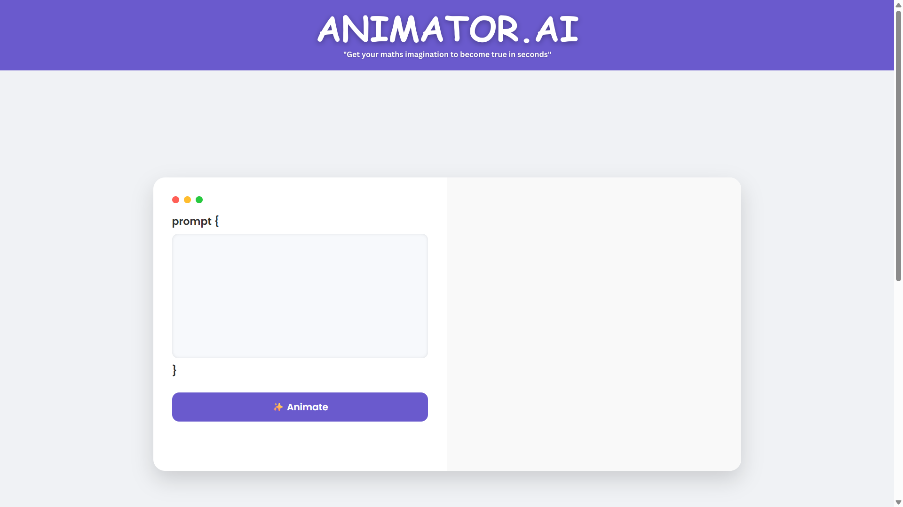
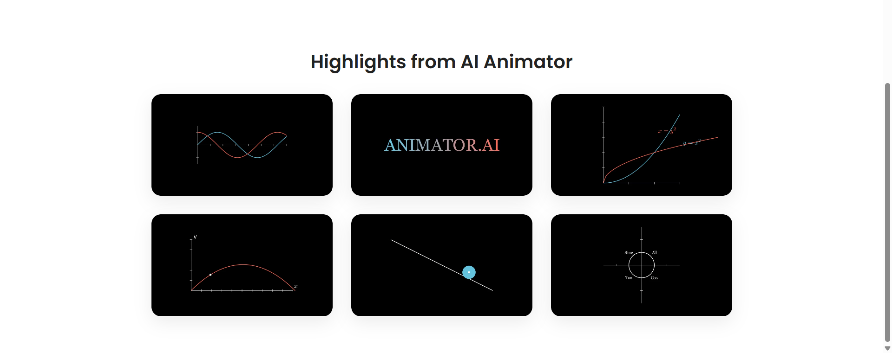

# AI Animator: Text-to-Animation Web App


**Video Demo:** [https://youtu.be/wxULek51Qhs](https://youtu.be/wxULek51Qhs)

**Live Demo:** [https://animator-ai.onrender.com/static](https://animator-ai.onrender.com/static)

AI Animator is a web application that generates Manim animations from natural language prompts. Leveraging FastAPI, OpenRouter's LLMs, and Manim, users can describe an animation in plain English and instantly receive a rendered video. The app features a modern UI and supports easy download of generated animations.

---


## Features

- **Text-to-Animation:** Describe your animation in plain English; get a Manim animation video.
- **Instant Video Preview:** Watch generated animations in the browser.
- **Download Support:** Download your animation as an MP4.
- **Modern UI:** Responsive and visually appealing interface.
---

## How It Works

1. **User Prompt:**  The user enters a prompt (e.g., "Show a circle transforming into a square").
2. **API Request:**   The frontend sends the prompt to `/api/generate-animation`.
3. **Code Generation:**  The backend uses OpenRouter's LLM to generate Manim v0.18.0 code based on the prompt.
4. **Animation Rendering:**  The generated code is executed by Manim, producing a video file.
5. **Video Delivery:**  The rendered video is served back to the frontend for viewing and download.
---
## Getting Started

### Prerequisites

- Python 3.8+
- [Manim Community Edition](https://www.manim.community/)
- Docker (optional)

### Installation

1. **Clone the repository:**
```
git clone <repo-url>
cd <repo-folder>
```

2. **Install dependencies:**
```
pip install -r requirements.txt
```

3. **Set up environment variables:**
- Copy `.env.example` to `.env` and add your OpenRouter API key.

4. **Run the app:**

```
uvicorn main:app --reload
```
- Access at `http://localhost:8000/static/index.html`

5. **(Optional) Docker:**
```
docker build -t ai-animator .
docker run -p 8000:8000 --env-file .env ai-animator
```

---

## Usage

- Open the web interface.
- Enter a prompt describing your animation.
- Click "Animate" and wait for the video to be generated.
- Download or view your animation.

---

## Configuration

- **API Key:** Add your OpenRouter API key to `.env` as `OPENROUTER_API_KEY`.

---

## Tech Stack

| Component   | Technology            |
|-------------|----------------------|
| Backend     | FastAPI, Python       |
| Frontend    | HTML, CSS, JavaScript|
| Animation   | Manim Community v0.18 |
| AI Model    | OpenRouter LLM API    |
| Container   | Docker (optional)     |

---
## Screenshots




---

## Acknowledgements

- [Manim Community](https://www.manim.community/)
- [OpenRouter](https://openrouter.ai/)
- [FastAPI](https://fastapi.tiangolo.com/)

---

**Happy Animating!**
